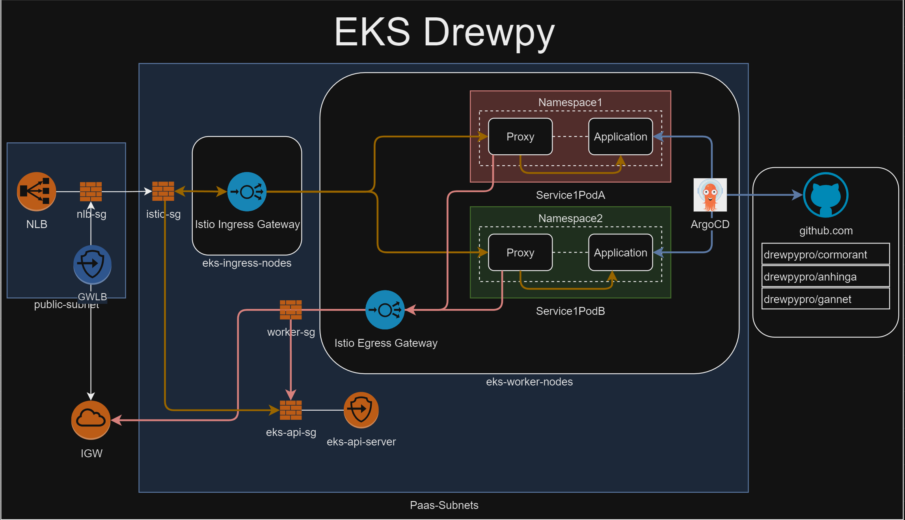

```
aws-eks-drewpy/
├── eks/
│   ├── eks.tf               # Main Terraform configuration for the EKS cluster
│   ├── main.tf              # Provider and base setup (may include variables or VPC setup)
│   ├── variables.tf         # Define variables like region, cluster name, etc.
│   ├── outputs.tf           # Outputs for reference (like cluster endpoint, kubeconfig, etc.)
│   └── iam.tf               # (Optional) IAM roles and policies for EKS
├── kubernetes/
│   ├── namespaces/
│   │   ├── namespace1.yaml  # Namespace configuration for Namespace1
│   │   └── namespace2.yaml  # Namespace configuration for Namespace2
│   ├── gateways/
│   │   ├── ingress-gateway.yaml  # Istio Ingress Gateway configuration
│   │   └── egress-gateway.yaml   # Istio Egress Gateway configuration
│   ├── virtual-services/
│   │   ├── service1-virtual-service.yaml  # VirtualService for routing to service in Namespace1
│   │   └── service2-virtual-service.yaml  # VirtualService for routing to service in Namespace2
│   └── deployments/
│       ├── app1-deployment.yaml  # Deployment configuration for app in Namespace1
│       └── app2-deployment.yaml  # Deployment configuration for app in Namespace2
└── README.md                   # Documentation on how to deploy and test
```

# TO DO
- Istio Created NLB security-group rules
- SG rules on cluster endpoint and ELB
- ArgoCD integration


# References
 - [Control Plane SG](https://registry.terraform.io/modules/terraform-aws-modules/eks/aws/latest#input_cluster_additional_security_group_ids)

# Goals
- Build EKS cluster
    - 2 worker nodes
    - 2 istio ingress nodes
    - 2 Pods with a namespace each
    - istio sidecar proxys in each pod.
- Build Security-Groups with appropriate rules
- Test Network connectivity (ping, ssh, http)
    - ec2 to namespace1 application 
        ```
        ec2->nlb->istio-ingress->istio-proxy->namespace1
        ```
    - ec2 to namespace2 application 
        ```
        ec2->nlb->istio-ingress->istio-proxy->namespace2
        ```
    - ec2 to pod
        ```
        ec2->pod1
        ```
    - ec2 to node
        ```
        ec2->node1
        ```
    - ec2 to eks-api-server
    - public internet to namespace1 app
        ```
        home_net->nlb->istio-ingress->istio-proxy->namespace1
        ```
    - Cloudflare WAF to ingress istio gateway. 
    - GWLB suricata on ingress (IDS or IPS)

# Validation

```

aws ec2 describe-network-interfaces     --query 'NetworkInterfaces[*].[PrivateIpAddress, Description, Groups[0].GroupName, InterfaceType]'     --output table

rm ~/.kube/config
aws eks update-kubeconfig --region us-east-1 --name eks-drewpy

kubectl get nodes
kubectl get namespaces
kubectl get pods -n istio-system
kubectl get pods -n namespace1
kubectl get pods -n namespace2
kubectl get svc
kubectl get svc -n istio-system
kubectl describe svc ingress-gateway -n istio-system
kubectl describe svc istiod -n istio-system
kubectl describe gateway egress-gateway -n istio-system
kubectl describe gateway ingress-gateway -n istio-system
kubectl get virtualservice -n namespace1
kubectl get virtualservice -n namespace2
kubectl describe virtualservice service1-virtual-service -n namespace1
kubectl describe virtualservice service2-virtual-service -n namespace2

# Testing

kubectl get pods -n <your-app-namespace>
kubectl exec -it <nginx-pod-name> -n <your-app-namespace> -- /bin/bash
kubectl logs <nginx-pod-name> -n <your-app-namespace>
kubectl logs -n istio-system $(kubectl get pods -n istio-system -l istio=ingressgateway -o jsonpath='{.items[0].metadata.name}')

istioctl proxy-config routes <ingress-pod-name> -n istio-system
istioctl proxy-config routes $(kubectl get pod -l app=istio-ingressgateway -n istio-system -o jsonpath='{.items[0].metadata.name}') -
n istio-system

kubectl describe nodes

aws s3 cp s3://logstorebucket/ ./exportedlogs --recursive
find exportedlogs/ -name "*.gz" -exec gunzip {} \;
find exportedlogs/dnsquerylogs/* -exec cat {} + > dnsqueries.csv
find exportedlogs/vpcflowlogs/* -exec cat {} + > vpcflowlogs.csv
find exportedlogs/ -exec cat {} + > flow_logs.csv

```