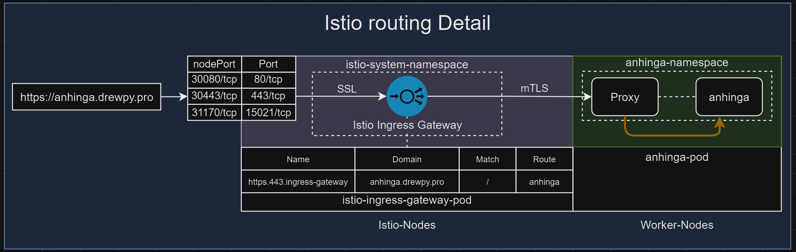

# aws-eks-drewpy
- [Overview](#overview)
- [Project Structure](#project-structure)
- [Prerequisites](#prerequisites)
- [Usage](#usage)
- [To Do](#to-do)
- [Validation](#validation)
- [Notes](#notes)
- [References](#references)
- [Contributing](#contributing)
- [Disclaimer](#disclaimer)
- [License](#license)

# Overview
- Creates necessary infrastructure to deploy drewpy-apps in an aws eks-drewpy cluster. 
- Builds eks and necessary vpc, iam and security-group infrastructure resources in AWS. 
- Configures Cloudflare DNS to proxy traffic towards internet nlb. 
- Configures kubectl, istio and argoCD to deploy 3 bird apps. 

# Project Structure

```
aws-eks-drewpy/
├── .drone.yml         # Private drone pipeline run config
├── cloudflare.tf         # Build DNS entries for domains
├── ec2.tf         # Test EC2 for private local testing (default:off)
├── eks.tf         # EKS configurations to build clusters and node groups. 
├── iam.tf         # IAM configuration for various resources.
├── nlb.tf         # Load balancer configuration
├── providers.tf         # Terraform providers and base configuration for cloudflare/aws. 
├── variables.tf         # Define variables like region, cluster name, etc.
├── vpc.tf         # Defines network infrastructure.
├── argocd/         # ArgoCD CRD definitions
│   ├── argocd-config.yaml         # ArgoCD Configuration Definition
│   ├── argocd-rbac.yaml         # ArgoCD Rbac Config
│   ├── apps/         # ArgoCD custom App definitions
│   │   ├── anhinga-application.yaml         # Anhinga App Definition
│   │   ├── cormorant-application.yaml         # Cormorant App Definition
│   │   ├── gannet-application.yaml         # Gannet App Definition
├── kubernetes/
│   ├── istio-config.yaml 
│   ├── namespaces/         # k8s core logical construct for grouping resources
│   │   ├── argocd-namespace.yaml         # Defines argo namespace without istio injection
│   ├── virtual-services/         # Istio virtualservice CRD
│   │   ├── argocd-virtual-service.yaml          # define argocd virtual-service
│   ├── gateways/         # Istio gateway CRD
│   │   ├── ingress-gateway.yaml  # Istio Ingress Gateway configuration
│   │   └── egress-gateway.yaml   # Istio Egress Gateway configuration
└── README.md                   # Documentation on how to deploy and test
```

# Prerequisites
- Latest versions of terraform, aws, kubectl and istioctl installed. 
- AWS credentials with roles to build vpc, eks, ec2 and iam. (among others)
- Cloudflare API token that allows (Zone:Zone:Read, Zone:Zone DNS:Edit )
- Cloudflare Zone ID (go to your main dashboard and copy zone ID from your list of domains)
- Public addresses that are authorized connectivity to the eks cluster api. 
- Or use Drone server pipeline (.drone.yml) or github action workflow pipeline (.github/workflows/terraform-apply.yaml)

# Usage
- clone repo and set secret variables prior to implementing in your pipeline of choice. 

  ```
  git clone https://github.com/drewpypro/aws-eks-drewpy

  cd aws-eks-drewpy/infrastructure

  export AWS_ACCESS_KEY_ID="<your-aws-key-id>
  export AWS_SECRET_ACCESS_KEY="<your-aws-secret>
  export CLOUDFLARE_API_TOKEN="<your-cloudflare-api-token>
  export CLOUDFLARE_EMAIL="<your-cloudflare-email-address>
  export CLOUDFLARE_ZONE_ID="<your-cloudflare-zone-id>
  export TF_VAR_HOME_IP="<your-public-home-ip>

  aws configure
  terraform apply
  cd ..
  aws eks update-kubeconfig --region us-east-1 --name eks-drewpy
  export KUBECONFIG=/root/.kube/config
  kubectl apply -f https://github.com/cert-manager/cert-manager/releases/download/v1.16.2/cert-manager.crds.yaml
  kubectl apply -f https://github.com/cert-manager/cert-manager/releases/download/v1.16.2/cert-manager.yaml
  kubectl wait --for=condition=available --timeout=300s deployment/cert-manager -n cert-manager
  kubectl wait --for=condition=available --timeout=300s deployment/cert-manager-webhook -n cert-manager
  kubectl wait --for=condition=available --timeout=300s deployment/cert-manager-cainjector -n cert-manager
  kubectl create secret generic cloudflare-api-token --from-literal=api-token=$CLOUDFLARE_API_TOKEN -n cert-manager || true
  helm repo add istio https://istio-release.storage.googleapis.com/charts
  helm repo update
  kubectl create namespace istio-system || true
  helm upgrade --install istio-base istio/base -n istio-system --create-namespace
  helm upgrade --install istiod istio/istiod -n istio-system --create-namespace
  helm upgrade --install istio-ingress istio/gateway -f manifests/istio-values.yaml -n istio-ingress --create-namespace 
  kubectl -n istio-system rollout status deploy/istiod --timeout=300s
  kubectl -n istio-ingress rollout status deploy/istio-ingress --timeout=300s
  kubectl apply -f manifests/istio-config.yaml
  sed -i "s|{{EMAIL_PLACEHOLDER}}|$CLOUDFLARE_EMAIL|" manifests/cert-manager.yaml 
  kubectl apply -f manifests/cert-manager.yaml
  kubectl wait --for=condition=available --timeout=300s deployment/cert-manager -n cert-manager
  helm repo add argo https://argoproj.github.io/argo-helm
  helm repo update
  helm upgrade --install argocd argo/argo-cd --namespace argocd --create-namespace -f manifests/argocd-values.yaml
  kubectl -n argocd rollout status deploy/argocd-server --timeout=300s
  kubectl apply -f manifests/argocd-install.yaml
  ```

# To Do 
- Define required apis and permissions for building resources in this repo.
- Billing output for 24 hours of use. 
- Create aws-kubectl-istio image for pipeline. 
- Automate WAF Ruleset resources

# Validation
- Describe network interfaces (handy for reviewing node level details)
  ```
  aws ec2 describe-network-interfaces \
      --query 'NetworkInterfaces[*].[PrivateIpAddress, Description, Groups[0].GroupName, InterfaceType, join(`, `, PrivateIpAddresses[?Primary==`false`].PrivateIpAddress)]' \
      --output table
  ```    

- Remove existing kube creds and apply new (run once after first time build)
  ```
  rm ~/.kube/config
  aws eks update-kubeconfig --region us-east-1 --name eks-drewpy
  ```

- Get nodes and role label 
  ```
  kubectl get nodes -o custom-columns=NAME:.metadata.name,ROLE:.metadata.labels.role
  NAME                         ROLE
  ip-10-0-1-144.ec2.internal   worker
  ip-10-0-1-37.ec2.internal    istio-ingress
  ip-10-0-2-224.ec2.internal   worker
  ip-10-0-2-86.ec2.internal    istio-ingress
  ```

- Various kubectl commands for validation of resources. 
  ```
  kubectl get nodes -A
  kubectl get namespaces -A -o wide
  kubectl get virtualservice -A
  kubectl get deployments -A
  kubectl get pods -A -o wide
  kubectl get svc -A -o wide
  kubectl logs <pod-name> -n <namespace>
  kubectl describe gateway egress-gateway -n istio-system
  kubectl describe gateway ingress-gateway -n istio-system
  ```

- Validate Istio routing
  ```
  istioctl proxy-config routes <ingress-pod-name> -n istio-system
  istioctl proxy-config routes $(kubectl get pod -l app=istio-ingressgateway -n istio-system -o jsonpath='{.items[0].metadata.name}') -n istio-system
  ```

- Retrieve ArgoCD initial secret
  ```
  kubectl -n argocd get secret argocd-initial-admin-secret -o jsonpath="{.data.password}" | base64 -d
  ```

- Debug tools ( DO NOT RUN THESE IN PRODUCTION )
  ```
  kubectl exec -it <pod-name> -n <your-app-namespace> -- /bin/bash <command>
  kubectl port-forward -n <namespace> svc/<svc-name> <localhost-port>:<svc-port>
  kubectl port-forward -n argocd svc/argocd-server 8080:80
  ```

- Retrieve and parse logs
  ```
  aws logs create-export-task \
      --task-name "ExportDNSQueryLogs" \
      --log-group-name "dns-query-logs" \
      --from <start-timestamp> \
      --to <end-timestamp> \
      --destination "logstorebuck" \
      --destination-prefix "dns-query-logs"

  aws logs create-export-task \
      --task-name "ExportVPCFlowLogs" \
      --log-group-name "vpc-flow-logs" \
      --from <start-timestamp> \
      --to <end-timestamp> \
      --destination "logstorebuck" \
      --destination-prefix "vpc-flow-logs"

  aws s3 cp s3://logstorebuck/ ./exportedlogs --recursive
  find exportedlogs/ -name "*.gz" -exec gunzip {} \;
  find exportedlogs/dnsquerylogs/* -exec cat {} + > dnsqueries.csv
  find exportedlogs/vpcflowlogs/* -exec cat {} + > vpcflowlogs.csv
  ```

- Backout (Helm)
  ```
  ## Destroy All Infrastructure (including kubernetes)
  terraform destroy --auto-approve yes

  kubectl delete -f manifests/argocd-install.yaml
  helm uninstall argocd -n argocd
  kubectl delete namespace argocd --wait
  kubectl delete -f manifests/cert-manager.yaml
  kubectl delete secret cloudflare-api-token -n cert-manager
  kubectl delete -f https://github.com/cert-manager/cert-manager/releases/download/v1.16.2/cert-manager.yaml
  kubectl delete -f manifests/istio-config.yaml
  helm uninstall istio-ingress -n istio-ingress
  helm uninstall istiod -n istio-system
  helm uninstall istio-base -n istio-system
  kubectl delete namespace istio-ingress --wait
  kubectl delete namespace istio-system --wait
  kubectl delete namespace cormorant-namespace gannet-namespace anhinga-namespace
  helm repo remove cert-manager
  helm repo remove istio
  helm repo remove argo
  ```

- Secure temporary testing subshell
  ```
  env -i bash --norc --noprofile
  export AWS_ACCESS_KEY_ID="<your-aws-key-id>
  export AWS_SECRET_ACCESS_KEY="<your-aws-secret>
  export CLOUDFLARE_API_TOKEN="<your-cloudflare-api-token>
  export CLOUDFLARE_EMAIL="<your-cloudflare-email-address>
  export CLOUDFLARE_ZONE_ID="<your-cloudflare-zone-id>
  export TF_VAR_HOME_IP="<your-public-home-ip>
  #perform testing and destroy subshell when completed
  exit
  ```

- Secure key handling with keepassxcli and temp subshell
  ```
  env -i bash --norc -noprofile
  export PATH=$PATH:/usr/local/bin/aws
  export API_KEY=$(keepassxc-cli show /path/to/your/database.kdbx "My API Key")
  export AWS_ACCESS_KEY_ID=$(keepassxc-cli show /path/to/your/database.kdbx "your-aws-key-id")
  export AWS_SECRET_ACCESS_KEY=$(keepassxc-cli show /path/to/your/database.kdbx "your-aws-secret")
  export CLOUDFLARE_API_TOKEN=$(keepassxc-cli show /path/to/your/database.kdbx "your-cloudflare-api-token")
  export CLOUDFLARE_EMAIL=$(keepassxc-cli show /path/to/your/database.kdbx "your-cloudflare-email-address")
  export CLOUDFLARE_ZONE_ID=$(keepassxc-cli show /path/to/your/database.kdbx "your-cloudflare-zone-id")
  export TF_VAR_HOME_IP=$(keepassxc-cli show /path/to/your/database.kdbx "your-public-home-ip")
  ```

# Notes

- **v1** (Core Group)
  - Includes “core” Kubernetes objects:
    - Services
    - Namespaces
    - Pods
    - ConfigMaps
    - Secrets
    - etc.

- **apps/v1** (Apps API Group)
  - Includes more advanced workload controllers:
    - Deployments
    - StatefulSets
    - DaemonSets
    - ReplicaSets
    - etc.

- **batch/v1** (Batch API Group)
  - Includes:
    - Jobs
    - CronJobs

- **autoscaling/v2** (Autoscaling API Group)
  - Includes:
    - HorizontalPodAutoscalers (HPAs)

- **networking.k8s.io/v1** (Networking API Group)
  - Includes:
    - Ingress and IngressClass
    - NetworkPolicy
  - Built-in resources for controlling external traffic (Ingress) and cluster networking policies.

- **Custom Resource Definitions (CRDs)**:
  - Introduce _additional_ resource types from third-party projects or operators (e.g., Istio, ArgoCD, Cert-Manager).
  - Appear under different `apiVersion` domains (e.g., `istio.io`, `argoproj.io`, `cert-manager.io`).
  - Only available after installing the CRD(s) into the cluster.

- **Namespace (apiVersion: v1, kind: Namespace)**:
  - Groups resources logically. All resources inside it must have metadata.namespace = <the name>.
  - Deleting a namespace removes all “namespace-scoped” resources in it (pods, services, deployments, etc.).

- **Deployment (apiVersion: apps/v1, kind: Deployment)**:
  - Manages ReplicaSets and Pods. 
  - You define:
    - The container image(s)
    - The number of replicas
    - Pod labels
  - The Deployment ensures your desired number of Pods is running.

- **Service (apiVersion: v1, kind: Service)**:
  - A stable network endpoint for a set of Pods. 
  - Commonly used types include:
    - ClusterIP (internal-only service)
    - NodePort (exposes a port on each node)
    - LoadBalancer (creates a cloud load balancer in some providers)
  - You match Pods by label selector (e.g., app: my-app).

- **Gateway (apiVersion: networking.istio.io/v1alpha3, kind: Gateway)**:
  - Defines how inbound or outbound traffic is handled at the edge. You might specify ports, protocols, TLS, etc.
  - In other words, it’s like a specialized Envoy config that replaces or augments something like NGINX Ingress.

- **VirtualService (apiVersion: networking.istio.io/v1alpha3, kind: VirtualService)**:
  - Defines routing rules within the mesh. For example, “traffic to /cormorant goes to the cormorant service on port 80.”
  - Typically bound to a Gateway for external traffic, or used internal to the mesh for service-to-service routing.

# References
 - [Control Plane SG](https://registry.terraform.io/modules/terraform-aws-modules/eks/aws/latest#input_cluster_additional_security_group_ids)
 - [AWS CLI Installation](https://docs.aws.amazon.com/cli/latest/userguide/getting-started-install.html#getting-started-install-instructions)
 - [Kubectl Installation](https://kubernetes.io/docs/tasks/tools/#kubectl)
 - [Istio Installation](https://istio.io/latest/docs/setup/getting-started/)
 - [ArgoCD Installation](https://argo-cd.readthedocs.io/en/stable/getting_started/)

# Contributing

- Fork the repository.
- Create a new branch for your feature or bugfix.
- Make your changes and test them thoroughly.
- Submit a pull request for review.

# Disclaimer

This project is provided "as is" without warranty of any kind, express or implied, including but not limited to the warranties of merchantability, fitness for a particular purpose, and noninfringement. Use this project at your own risk. The maintainers of this repository are not responsible for any damage or issues arising from its use.

# License

This project is licensed under the MIT License. This means you are free to use, modify, and distribute the code as long as credit is given to the original author.

```
Copyright (c) 2024 drewpypro

Permission is hereby granted, free of charge, to any person obtaining a copy
of this software and associated documentation files (the "Software"), to deal
in the Software without restriction, including without limitation the rights
to use, copy, modify, merge, publish, distribute, sublicense, and/or sell
copies of the Software, and to permit persons to whom the Software is
furnished to do so, subject to the following conditions:

The above copyright notice and this permission notice shall be included in all
copies or substantial portions of the Software.
```