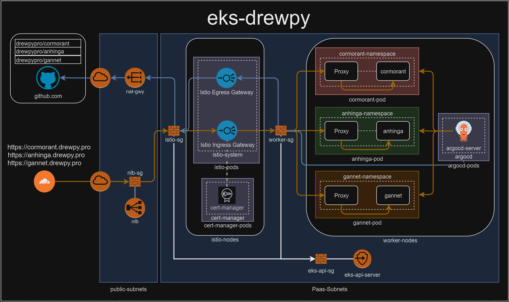

```
aws-eks-drewpy/
├── eks/
│   ├── eks.tf               # Main Terraform configuration for the EKS cluster
│   ├── main.tf              # Provider and base setup (may include variables or VPC setup)
│   ├── variables.tf         # Define variables like region, cluster name, etc.
│   ├── outputs.tf           # Outputs for reference (like cluster endpoint, kubeconfig, etc.)
│   └── iam.tf               # (Optional) IAM roles and policies for EKS
├── kubernetes/
│   ├── namespaces/
│   │   ├── namespace1.yaml  # Namespace configuration for Namespace1
│   │   └── namespace2.yaml  # Namespace configuration for Namespace2
│   ├── gateways/
│   │   ├── ingress-gateway.yaml  # Istio Ingress Gateway configuration
│   │   └── egress-gateway.yaml   # Istio Egress Gateway configuration
│   ├── virtual-services/
│   │   ├── service1-virtual-service.yaml  # VirtualService for routing to service in Namespace1
│   │   └── service2-virtual-service.yaml  # VirtualService for routing to service in Namespace2
│   └── deployments/
│       ├── app1-deployment.yaml  # Deployment configuration for app in Namespace1
│       └── app2-deployment.yaml  # Deployment configuration for app in Namespace2
└── README.md                   # Documentation on how to deploy and test
```
# References
 - [Control Plane SG](https://registry.terraform.io/modules/terraform-aws-modules/eks/aws/latest#input_cluster_additional_security_group_ids)
 
# Goals
- Build EKS cluster
    - 2 worker nodes
    - 2 istio ingress nodes
    - 2 Pods with a namespace each
    - istio sidecar proxys in each pod.
- Build Security-Groups with appropriate rules
- Test Network connectivity
    - ec2 to namespace1 application 
        ```
        ec2->nlb->istio-ingress->istio-proxy->namespace1
        ```
    - ec2 to namespace2 application 
        ```
        ec2->nlb->istio-ingress->istio-proxy->namespace2
        ```
    - ec2 to pod
        ```
        ec2->pod1
        ```
    - ec2 to node
        ```
        ec2->node1
        ```
    -ec2 to eks-api-server